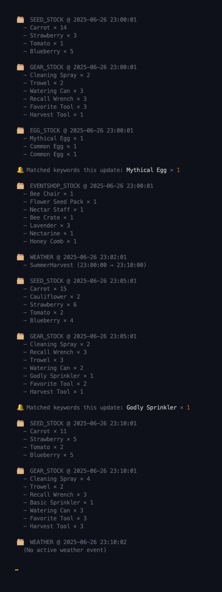

# Grow a Garden on Roblox
_A lightweight Python WebSocket client for Grow a Garden on Roblox (macOS-friendly)_


## WebSocket Listener
Listens for live stock updates from the **Grow a Garden** Roblox game and alerts you when specific items appear.

## What is Grow a Garden?
**Grow a Garden** is a Roblox game where players plant, harvest, and sell crops. This listener connects to its **unofficial WebSocket API** to deliver **real-time inventory alerts** straight to your Mac terminal — perfect for serious traders and inventory hoarders.

### 🖥️ Example Output
Real-time terminal output (with WEATHER event duration):  


## Features
- Real-time updates via WebSocket (low overhead, no constant polling)
- Lightweight design — reacts instantly by _listening_, like we wish all our friends did
- Configurable keyword alerts
- macOS desktop notifications (`osascript`)
- Weather event display
- Toggle notifications via CLI (`notify=1` or `notify=0`)

## Requirements
- Python 3.8+
- macOS (for notification support)
- Internet connection

## Setup
```bash
python3 -m venv venv
source venv/bin/activate
pip install -r requirements.txt
```

Create a keywords.txt file and add one item per line (case-insensitive), e.g.:
```
Advanced Sprinkler
Carrot
```

## Running
```bash
./start.sh           # Runs with macOS notifications ON (default)
./start.sh notify=0  # Disable notifications
./start.sh notify=1  # Explicitly enable notifications
```

Edit **websocket_listener.py** and replace YOUR_DISCORD_ID_HERE with your Discord User ID.

>  [How to find your Discord User ID](https://support.discord.com/hc/en-us/articles/206346498-Where-can-I-find-my-User-Server-Message-ID).

## Notes
- This script is macOS-only (uses osascript for notifications).
- Tested on macOS 14+ with iTerm2.
- PRs welcome!
